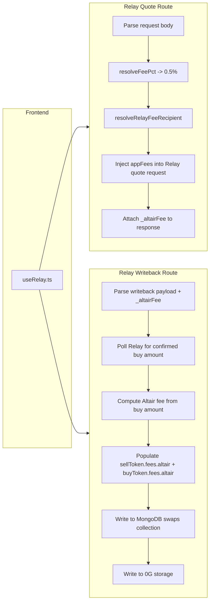
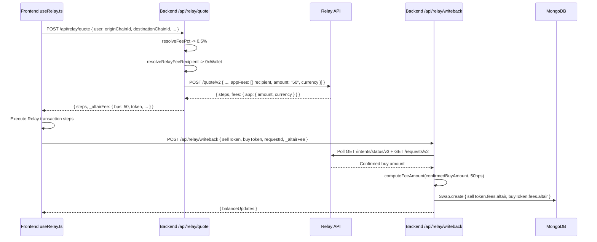

# Cross-chain Altair Fees (Relay) — Implementation Plan

## Overview

Integrate Altair's 0.5% fee on cross-chain bridging and swaps executed via Relay. Relay supports an **App Fee** mechanism where the integrator (Altair) specifies a fee in basis points and a recipient address in the quote request. Relay deducts the fee from the **output** (buy token) and accumulates it in their system for claiming.

**Key difference from 0x/Jupiter:** Relay's App Fee is not deducted on-chain by the protocol. Instead, Relay deducts the fee from the quoted output amount and holds it internally. The integrator claims accumulated fees via Relay's App Fee claiming API (`POST /app-fees/{wallet}/claim`). This means:
- The fee is **not visible on-chain** as a transfer to a recipient address
- The fee is **reflected in the quoted buy amount** (Relay returns the post-fee amount)
- Fee claiming is a separate operational process via Relay's API

---

## 1. Fee Resolution

### 1.1 Config Values (already defined)

From [`fees_config.ts`](../../config/fees_config.ts):

| Key | Value |
|-----|-------|
| `UNIVERSAL_FEES.ALL` | `0.5` (percent) |
| `BRIDGING_FEES.ALL` | `null` (falls through to `UNIVERSAL_FEES.ALL`) |
| `BRIDGING_FEES.crossChainSwap` | `null` (falls through to `UNIVERSAL_FEES.ALL`) |
| `BRIDGING_FEES.Relay.ALL` | `null` (falls through to `UNIVERSAL_FEES.ALL`) |
| `BRIDGING_FEES.Relay.crossChainSwap` | `null` (falls through to `UNIVERSAL_FEES.ALL`) |
| `BRIDGING_FEES.Relay.singleChainSwap` | `null` (falls through to `UNIVERSAL_FEES.ALL`) |

### 1.2 Effective Fee Resolution

For Relay cross-chain swaps/bridges, the priority chain resolves as:

```
UNIVERSAL_FEES.ALL = 0.5
  → BRIDGING_FEES.ALL = null
  → BRIDGING_FEES.crossChainSwap = null
  → BRIDGING_FEES.Relay.ALL = null
  → BRIDGING_FEES.Relay.crossChainSwap = null
  → Result: 0.5 (from UNIVERSAL_FEES.ALL)
```

The existing [`resolveFeePct()`](../../src/lib/feeResolver.ts) function already handles this correctly when called with:
```ts
resolveFeePct({ action: 'crossChainSwap', platform: 'Relay', chainType: 'BRIDGING' })
```

### 1.3 Fee Recipient Address for Relay

Relay's App Fee mechanism requires a **wallet address** as the fee recipient. This is the wallet that will accumulate fees and can claim them via Relay's API. Unlike 0x's `FEE_RECIPIENT_ADDRESSES` (which maps chain keys to addresses), Relay uses a single wallet address for all chains — the fees accumulate in Relay's system keyed by this wallet.

**Action needed:** Add a `RELAY_FEE_RECIPIENT` field to [`fees_config.ts`](../../config/fees_config.ts). This should be the wallet address that Altair controls and will use to claim fees from Relay.

```ts
// Add to fees_config.ts
export const RELAY_FEE_RECIPIENT = process.env.RELAY_FEE_RECIPIENT ?? '0xYourWalletAddressHere';
```

Alternatively, this can be an environment variable `RELAY_FEE_RECIPIENT` that defaults to one of the existing `FEE_RECIPIENT_ADDRESSES` entries (e.g., `ETH_MAINNET`).

### 1.4 New Helper: `resolveRelayFeeRecipient()`

Add a new exported function to [`feeResolver.ts`](../../src/lib/feeResolver.ts):

```ts
/**
 * Resolve the Relay fee recipient wallet address.
 * Relay uses a single wallet address for fee accumulation across all chains.
 */
export function resolveRelayFeeRecipient(): string | null {
  return RELAY_FEE_RECIPIENT ?? null;
}
```

---

## 2. Relay App Fee Mechanism

### 2.1 How Relay App Fees Work

Based on the [App Fees documentation](../external_docs/Relay%20Docs/Taking%20Transaction%20Fees/App%20Fees.pdf):

1. **Quote Request:** The `appFees` parameter is passed in the POST `/quote/v2` request body:
   ```json
   {
     "user": "0x...",
     "originChainId": 1,
     "destinationChainId": 8453,
     "originCurrency": "0x...",
     "destinationCurrency": "0x...",
     "amount": "1000000",
     "tradeType": "EXACT_INPUT",
     "appFees": [
       {
         "recipient": "0xYourWalletAddress",
         "amount": "50",
         "currency": "0xDestinationTokenAddress"
       }
     ]
   }
   ```
   - `recipient`: The wallet address that will receive/accumulate the fee
   - `amount`: Fee amount in **basis points** (e.g., `50` = 0.5%)
   - `currency`: The token address the fee is taken in (typically the destination/buy token)

2. **Quote Response:** The response includes a `fees.app` object with fee details:
   ```json
   {
     "steps": [...],
     "fees": {
       "app": {
         "amount": "5000",
         "amountFormatted": "0.005",
         "currency": "0x...",
         "currencyDecimals": 18
       }
     }
   }
   ```

3. **Fee Deduction:** Relay deducts the fee from the output (buy token) before delivering to the user. The `steps` contain the post-fee transaction data.

4. **Fee Accumulation:** Fees accumulate in Relay's system, keyed by the recipient wallet address.

### 2.2 Fee Balance Checking

Fees can be checked via `GET /app-fees/{wallet}/balances`:
```json
{
  "balances": [
    {
      "currency": "0x...",
      "amount": "1000000",
      "amountFormatted": "1.0",
      "amountUsd": 1.50
    }
  ]
}
```

### 2.3 Fee Claiming

Fees are claimed via `POST /app-fees/{wallet}/claim`:
```json
{
  "chainId": 8453,
  "currency": "0x...",
  "recipient": "0xYourWalletAddress",
  "amount": "1000000"
}
```

The response contains `steps` array with the claim transaction data.

---

## 3. Backend Changes — Relay Quote Route

### 3.1 File: [`altair_backend1/src/app/api/relay/quote/route.ts`](../../src/app/api/relay/quote/route.ts)

#### 3.1.1 Import fee resolvers

Add imports:
```ts
import { resolveFeePct, pctToBps, resolveRelayFeeRecipient } from '@/lib/feeResolver';
```

#### 3.1.2 Add `appFees` to the quote request

After parsing the incoming payload and before forwarding to Relay's `/quote/v2` endpoint, inject the `appFees` parameter:

```ts
// Resolve Altair fee for Relay
const feePct = resolveFeePct({ action: 'crossChainSwap', platform: 'Relay', chainType: 'BRIDGING' });
let appFees: Array<{ recipient: string; amount: string; currency: string }> | undefined;

if (feePct !== null && feePct > 0) {
  const feeRecipient = resolveRelayFeeRecipient();
  const feeBps = pctToBps(feePct); // e.g., 0.5 → 50
  if (feeRecipient) {
    // The fee currency is the destination currency (buy token)
    // Relay deducts the fee from the output
    appFees = [{
      recipient: feeRecipient,
      amount: String(feeBps),
      currency: payload.destinationCurrency,
    }];
  }
}

// Add appFees to the forwarded payload
const relayPayload = {
  ...payload,
  ...(appFees ? { appFees } : {}),
};
```

Then use `relayPayload` instead of `payload` in the fetch call to Relay.

#### 3.1.3 Pass fee metadata in the response

The quote response should include the resolved fee info so the frontend can pass it through to the writeback. Add a `_altairFee` field to the response:

```ts
const data = (await response.json()) as RelayQuoteResponse;

// Attach Altair fee metadata for writeback propagation
const responseWithFee = {
  ...data,
  _altairFee: appFees
    ? {
        token: payload.destinationCurrency,
        amount: null, // will be computed in writeback from confirmed buy amount
        decimals: null,
        bps: pctToBps(feePct!),
      }
    : null,
};

return NextResponse.json(responseWithFee, { headers: corsHeaders });
```

### 3.2 Update `RelayQuoteResponse` type

In [`relay_config.ts`](../../config/relay_config.ts), add the `_altairFee` field to `RelayQuoteResponse`:

```ts
export type RelayQuoteResponse = {
  steps: Array<{...}>;
  details?: Record<string, unknown>;
  fees?: Record<string, unknown>;
  protocol?: Record<string, unknown>;
  _altairFee?: {
    token: string;
    amount: string | null;
    decimals: number | null;
    bps: number;
  } | null;
};
```

---

## 4. Backend Changes — Relay Writeback Route

### 4.1 File: [`altair_backend1/src/app/api/relay/writeback/route.ts`](../../src/app/api/relay/writeback/route.ts)

#### 4.1.1 Import fee resolvers

Add imports:
```ts
import { resolveFeePct, pctToBps, computeFeeAmount } from '@/lib/feeResolver';
```

#### 4.1.2 Accept `_altairFee` in the writeback payload

Update the payload type to accept the fee metadata from the frontend:

```ts
const payload = (await req.json()) as {
  cid?: string | null;
  intentString?: string | null;
  sellToken?: RelayWritebackToken | null;
  buyToken?: RelayWritebackToken | null;
  txHash?: string | null;
  requestId?: string | null;
  _altairFee?: {
    token: string;
    amount: string | null;
    decimals: number | null;
    bps: number;
  } | null;
};
```

#### 4.1.3 Compute and populate the Altair fee

After the confirmed buy amount is resolved (or falls back to the frontend estimate), compute the Altair fee and populate the `altair` fee slot in both `sellToken` and `buyToken`.

**Where to add:** After the confirmed buy amount resolution block (after line ~371) and before the `swapDoc` construction (line ~375):

```ts
// --- Altair fee computation ---
// The fee is deducted from the buy token (output) by Relay.
// Compute it from the (possibly confirmed) buy amount.
let resolvedAltairFee: { token: string; amount: string; decimals: number | null; bps: number } | null = null;

if (payload._altairFee && payload._altairFee.bps > 0) {
  const buyAmountForFee = confirmedBuyAmountRaw ?? buyToken.amount;
  const feeAmount = computeFeeAmount(buyAmountForFee, payload._altairFee.bps);
  if (feeAmount !== '0') {
    resolvedAltairFee = {
      token: payload._altairFee.token || buyToken.symbol || '',
      amount: feeAmount,
      decimals: payload._altairFee.decimals ?? buyToken.decimals,
      bps: payload._altairFee.bps,
    };
  }
}
```

#### 4.1.4 Populate `altair` fee slot in sellToken and buyToken

Modify the `sellToken` and `buyToken` construction to use the computed fee:

```ts
// In sellToken fees section (line ~286):
altair: {
  token: resolvedAltairFee?.token ?? payload.sellToken.fees?.altair?.token ?? '',
  amount: resolvedAltairFee?.amount ?? payload.sellToken.fees?.altair?.amount ?? '',
  decimals: resolvedAltairFee?.decimals ?? (typeof payload.sellToken.fees?.altair?.decimals === 'number' ? payload.sellToken.fees.altair.decimals : null),
  bps: resolvedAltairFee?.bps ?? null,  // NEW: add bps field
},

// In buyToken fees section (line ~314):
altair: {
  token: resolvedAltairFee?.token ?? payload.buyToken.fees?.altair?.token ?? '',
  amount: resolvedAltairFee?.amount ?? payload.buyToken.fees?.altair?.amount ?? '',
  decimals: resolvedAltairFee?.decimals ?? (typeof payload.buyToken.fees?.altair?.decimals === 'number' ? payload.buyToken.fees.altair.decimals : null),
  bps: resolvedAltairFee?.bps ?? null,  // NEW: add bps field
},
```

#### 4.1.5 Update `RelayWritebackToken` type

Add `bps` to the `altair` fee sub-object:

```ts
altair?: { token?: string | null; amount?: string | null; decimals?: number | null; bps?: number | null } | null;
```

---

## 5. Frontend Changes — `useRelay.ts`

### 5.1 File: [`altair_frontend1/src/lib/useRelay.ts`](../../../altair_frontend1/src/lib/useRelay.ts)

#### 5.1.1 Extract `_altairFee` from the quote response

After the quote is received (around line ~596), extract the `_altairFee` metadata:

```ts
// After: relayQuote = await withWaitLogger(...)
const altairFeeMeta = (relayQuote as any)?._altairFee as {
  token: string;
  amount: string | null;
  decimals: number | null;
  bps: number;
} | null;
```

#### 5.1.2 Pass `_altairFee` in the writeback payload

In the writeback payload construction (around line ~1188), add `_altairFee`:

```ts
const relayWritebackPayload = {
  cid: cid ?? null,
  intentString: intent.type,
  sellToken: { ... },
  buyToken: { ... },
  requestId: requestId ?? null,
  _altairFee: altairFeeMeta,  // NEW: pass fee metadata to backend
};
```

#### 5.1.3 No changes needed to fee display

The fee is transparent to the user — Relay deducts it from the output, and the quoted buy amount already reflects the post-fee amount. The balance updates from the writeback response will reflect the correct post-fee balances.

---

## 6. Config Changes

### 6.1 File: [`altair_backend1/config/fees_config.ts`](../../config/fees_config.ts)

Add a Relay fee recipient address:

```ts
// Relay uses a single wallet address for fee accumulation across all chains.
// This wallet will claim fees via Relay's /app-fees/{wallet}/claim API.
export const RELAY_FEE_RECIPIENT = process.env.RELAY_FEE_RECIPIENT ?? '0xfA7b97Bc73521B5A9cfFF6F4863f91bf84810935';
```

The default value reuses the existing ETH_MAINNET fee recipient address, but this should be set to the wallet that will actually claim fees from Relay.

### 6.2 File: [`altair_backend1/config/relay_config.ts`](../../config/relay_config.ts)

Update `RelayQuoteResponse` type to include `_altairFee` (as described in section 3.2).

---

## 7. feeResolver.ts Changes

### 7.1 File: [`altair_backend1/src/lib/feeResolver.ts`](../../src/lib/feeResolver.ts)

#### 7.1.1 Add import for `RELAY_FEE_RECIPIENT`

```ts
import {
  UNIVERSAL_FEES,
  EVM_FEES,
  SVM_FEES,
  BRIDGING_FEES,
  REFERRAL_ACCOUNTS,
  FEE_RECIPIENT_ADDRESSES,
  RELAY_FEE_RECIPIENT,  // NEW
} from '../../config/fees_config';
```

#### 7.1.2 Add `resolveRelayFeeRecipient()` function

```ts
/**
 * Resolve the Relay fee recipient wallet address.
 * Relay uses a single wallet address for fee accumulation across all chains.
 * Fees are claimed via POST /app-fees/{wallet}/claim.
 */
export function resolveRelayFeeRecipient(): string | null {
  return RELAY_FEE_RECIPIENT ?? null;
}
```

---

## 8. Fee Claiming (Operational)

### 8.1 Checking Fee Balances

```bash
curl -X GET "https://api.relay.link/app-fees/0xYourWalletAddress/balances" \
  -H "Content-Type: application/json"
```

### 8.2 Claiming Fees

```bash
curl -X POST "https://api.relay.link/app-fees/0xYourWalletAddress/claim" \
  -H "Content-Type: application/json" \
  -d '{
    "chainId": 8453,
    "currency": "0xDestinationTokenAddress",
    "recipient": "0xYourWalletAddress",
    "amount": "1000000"
  }'
```

### 8.3 Automated Fee Claiming (Future)

A scheduled job (e.g., cron job or Vercel Cron) could periodically:
1. Check fee balances via `GET /app-fees/{wallet}/balances`
2. Claim fees above a threshold via `POST /app-fees/{wallet}/claim`
3. Execute the claim transaction steps returned by Relay

This is a separate operational concern and not part of the initial implementation.

---

## 9. Files to Modify

| File | Change |
|------|--------|
| [`altair_backend1/config/fees_config.ts`](../../config/fees_config.ts) | **Modify** — add `RELAY_FEE_RECIPIENT` constant |
| [`altair_backend1/config/relay_config.ts`](../../config/relay_config.ts) | **Modify** — add `_altairFee` to `RelayQuoteResponse` type |
| [`altair_backend1/src/lib/feeResolver.ts`](../../src/lib/feeResolver.ts) | **Modify** — add `resolveRelayFeeRecipient()` function |
| [`altair_backend1/src/app/api/relay/quote/route.ts`](../../src/app/api/relay/quote/route.ts) | **Modify** — inject `appFees` into Relay quote request; attach `_altairFee` to response |
| [`altair_backend1/src/app/api/relay/writeback/route.ts`](../../src/app/api/relay/writeback/route.ts) | **Modify** — compute Altair fee from confirmed buy amount; populate `altair` fee slot with `bps` |
| [`altair_frontend1/src/lib/useRelay.ts`](../../../altair_frontend1/src/lib/useRelay.ts) | **Modify** — extract `_altairFee` from quote response; pass it in writeback payload |

---

## 10. Testing Checklist

- [ ] **Unit test** `resolveRelayFeeRecipient()` returns the configured address
- [ ] **Unit test** `resolveFeePct({ action: 'crossChainSwap', platform: 'Relay', chainType: 'BRIDGING' })` resolves to `0.5`
- [ ] **Integration test**: Execute a Relay cross-chain swap (e.g., ETH→USDC on Base), verify:
  - Relay quote request includes `appFees: [{ recipient, amount: "50", currency }]`
  - Quote response includes `_altairFee` metadata with correct `bps: 50`
  - Writeback payload includes `_altairFee` from frontend
  - Swap document in MongoDB has `sellToken.fees.altair` and `buyToken.fees.altair` populated with correct token, amount, decimals, bps
  - `balanceUpdates` in writeback response reflect post-fee balances
- [ ] **Regression test**: Relay swaps with `UNIVERSAL_FEES.ALL = 0` or `null` — no `appFees` added to quote request
- [ ] **Regression test**: EVM swaps (0x) and Solana swaps (Jupiter) are unaffected — no Relay fee logic runs for non-Relay paths
- [ ] **Testnet verification**: Run on BASE_SEPOLIA or ETH_SEPOLIA with Relay testnet API, verify fee params are sent and swap succeeds
- [ ] **Fee claiming test**: After testnet swap, check fee balances via `GET /app-fees/{wallet}/balances` and verify the fee accumulated

---

## 11. Rollout

1. Merge the code changes
2. Verify on testnet first (BASE_SEPOLIA or ETH_SEPOLIA with Relay testnet API)
3. Monitor swap documents in MongoDB to confirm `sellToken.fees.altair` and `buyToken.fees.altair` are populated for Relay swaps
4. After ~1 week of production swaps, check fee balances via Relay's App Fee Balances API
5. Set up automated fee claiming if volume justifies it

---

## 12. Architecture Diagram



---

## 13. Fee Data Flow



---

## 14. Future Improvements

### 14.1 On-Chain Fee Verification

Unlike 0x (where the fee is sent to a recipient address on-chain) and Jupiter (where the fee goes to a referral token account), Relay's App Fee is **not on-chain**. The fee is deducted by Relay before delivering the output to the user. This means:
- There is no on-chain transfer to verify
- The fee amount recorded in MongoDB is the best available record
- Verification is done via Relay's App Fee Balances API

### 14.2 Multi-Token Fee Accumulation

If Relay swaps involve different destination tokens, fees will accumulate in multiple currencies. The claiming process needs to handle each currency separately.

### 14.3 Fee Dashboard

A future dashboard could display accumulated fees from all platforms (0x, Jupiter, Relay) in one place, using:
- 0x: On-chain balance of `FEE_RECIPIENT_ADDRESSES`
- Jupiter: Referral token account balances
- Relay: `GET /app-fees/{wallet}/balances`
