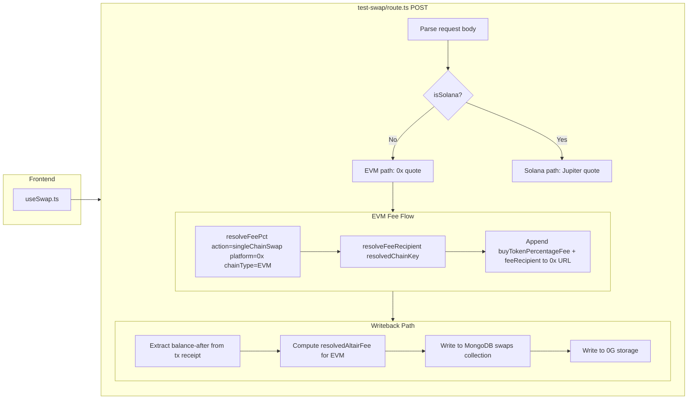
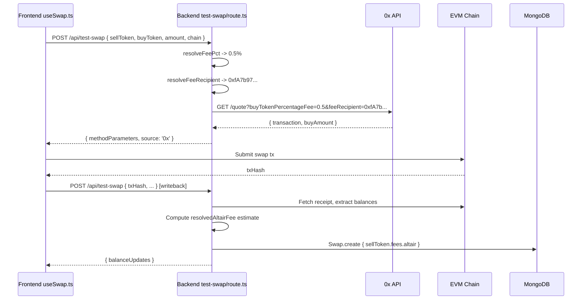

# EVM Altair Fees — Implementation Plan

## Overview

Integrate Altair's 0.5% fee on single-chain EVM swaps using 0x's affiliate fee mechanism. The fee is taken from the **buy token** (output) as a percentage, via 0x's `buyTokenPercentageFee` and `feeRecipient` query parameters. 0x handles the fee deduction on-chain — the `buyAmount` returned by 0x already reflects the post-fee amount.

**Key difference from SVM/Jupiter:** Jupiter takes fees from the **sell token** (input) via referral accounts. 0x takes fees from the **buy token** (output) via a fee recipient address and percentage parameter. The fee resolution logic in `feeResolver.ts` already supports both patterns.

---

## 1. Fee Resolution

### 1.1 Config Values (already defined)

From [`fees_config.ts`](../../config/fees_config.ts):

| Key | Value |
|-----|-------|
| `UNIVERSAL_FEES.ALL` | `0.5` (percent) |
| `EVM_FEES.singleChainSwap` | `null` (falls through to `UNIVERSAL_FEES.ALL`) |
| `EVM_FEES['0x'].ALL` | `null` (falls through to `UNIVERSAL_FEES.ALL`) |
| `EVM_FEES['0x'].singleChainSwap` | `null` (falls through to `UNIVERSAL_FEES.ALL`) |
| `FEE_RECIPIENT_ADDRESSES.ETH_MAINNET` | `0xfA7b97Bc73521B5A9cfFF6F4863f91bf84810935` |
| `FEE_RECIPIENT_ADDRESSES.ETH_SEPOLIA` | `0xfA7b97Bc73521B5A9cfFF6F4863f91bf84810935` |
| `FEE_RECIPIENT_ADDRESSES.BASE_MAINNET` | `0xfA7b97Bc73521B5A9cfFF6F4863f91bf84810935` |
| `FEE_RECIPIENT_ADDRESSES.BASE_SEPOLIA` | `0xfA7b97Bc73521B5A9cfFF6F4863f91bf84810935` |

### 1.2 Effective Fee Resolution

For EVM single-chain swaps via 0x, the priority chain resolves as:

```
UNIVERSAL_FEES.ALL = 0.5
  → EVM_FEES.singleChainSwap = null
  → EVM_FEES['0x'].ALL = null
  → EVM_FEES['0x'].singleChainSwap = null
  → Result: 0.5 (from UNIVERSAL_FEES.ALL)
```

The existing [`resolveFeePct()`](../../src/lib/feeResolver.ts) function already handles this correctly when called with:
```ts
resolveFeePct({ action: 'singleChainSwap', platform: '0x', chainType: 'EVM' })
```

### 1.3 Fee Recipient Address Lookup

The existing `FEE_RECIPIENT_ADDRESSES` in [`fees_config.ts`](../../config/fees_config.ts) maps chain keys to recipient addresses. A new helper function is needed in [`feeResolver.ts`](../../src/lib/feeResolver.ts):

```ts
export function resolveFeeRecipient(chainKey: ChainKey): string | null {
  const entry = (FEE_RECIPIENT_ADDRESSES as Record<string, string>)[chainKey];
  return entry ?? null;
}
```

This is simpler than `resolveReferralAccount` because 0x uses a flat per-chain address map rather than a nested platform/apiType structure.

---

## 2. Backend Changes — `test-swap/route.ts`

### 2.1 Import the new resolver

Add to the existing imports from `@/lib/feeResolver`:

```ts
import {
  resolveFeePct,
  resolveReferralAccount,
  resolveFeeRecipient,  // NEW
  pctToBps,
} from '@/lib/feeResolver';
```

### 2.2 Fee resolution at quote time (EVM path only)

Inside the `else` block (EVM path, around line ~1026 where `provider` is set to `'0x'`), **after** `sellAmountRaw` is computed (line ~2202) and **before** the 0x quote URLs are built (lines ~2229 for v1, ~2310 for v2):

1. Call `resolveFeePct({ action: 'singleChainSwap', platform: '0x', chainType: 'EVM' })`
2. If the result is non-null and > 0:
   - Compute `feeBps = pctToBps(resolvedFeePct)` (e.g., 0.5% → 50 bps)
   - Compute `feePct = resolvedFeePct` (0x uses percentage, not bps)
   - Call `resolveFeeRecipient(resolvedChainKey)` to get the fee recipient address for the current chain
   - If a fee recipient is returned, append `&buyTokenPercentageFee=${feePct}` and `&feeRecipient=${encodeURIComponent(feeRecipient)}` to the 0x quote URL

**Important:** The fee params must be added to **both** the v1 (testnet) and v2 (mainnet) URL builders.

#### 2.2.1 v1 URL (testnet, line ~2229)

```ts
// Current:
const v1Url = new URL(v1Endpoint);
v1Url.searchParams.set('sellToken', zeroXSellToken);
v1Url.searchParams.set('buyToken', zeroXBuyToken);
v1Url.searchParams.set('sellAmount', sellAmountRaw);
v1Url.searchParams.set('takerAddress', recipient);
v1Url.searchParams.set('slippagePercentage', '0.005');

// Modified — add after slippagePercentage:
if (feeRecipient !== null && feePct !== null && feePct > 0) {
  v1Url.searchParams.set('buyTokenPercentageFee', String(feePct));
  v1Url.searchParams.set('feeRecipient', feeRecipient);
}
```

#### 2.2.2 v2 URL (mainnet, line ~2310)

```ts
// Current:
const v2Url = new URL('https://api.0x.org/swap/allowance-holder/quote');
v2Url.searchParams.set('chainId', String(chainConfig.chainId));
v2Url.searchParams.set('sellToken', zeroXV2SellToken);
v2Url.searchParams.set('buyToken', zeroXV2BuyToken);
v2Url.searchParams.set('sellAmount', sellAmountRaw);
v2Url.searchParams.set('taker', recipient);
v2Url.searchParams.set('slippageBps', '50');

// Modified — add after slippageBps:
if (feeRecipient !== null && feePct !== null && feePct > 0) {
  v2Url.searchParams.set('buyTokenPercentageFee', String(feePct));
  v2Url.searchParams.set('feeRecipient', feeRecipient);
}
```

### 2.3 Fee metadata in the writeback payload

The 0x API response does **not** include a separate fee breakdown in the response body. The `buyAmount` in the quote response already reflects the post-fee amount. However, the fee information should be recorded in the Swap document for audit/history.

In the writeback path (the MongoDB `try` block starting at line ~1248), the `resolvedAltairFee` variable is already declared at the outer scope (from the SVM implementation). The EVM path needs to populate it.

**Where to populate `resolvedAltairFee` for EVM:**

After the 0x quote is fetched and `methodParameters` is set (around line ~2401), **before** the response is returned, compute the fee estimate:

```ts
// After fee resolution at the top of the EVM block:
let evmAltairFeePct: number | null = null;
let evmFeeRecipient: string | null = null;
{
  const feePct = resolveFeePct({ action: 'singleChainSwap', platform: '0x', chainType: 'EVM' });
  if (feePct !== null && feePct > 0) {
    evmAltairFeePct = feePct;
    evmFeeRecipient = resolveFeeRecipient(resolvedChainKey);
  }
}
```

Then, in the writeback path, the existing `resolvedAltairFee` logic needs to handle EVM swaps too. Currently the fee extraction logic only runs for Solana:

```ts
// Current (line ~1653):
if (isSolana && altairFeeBps !== null && referralAccount !== null) { ... }

// Modified — also handle EVM:
if (isSolana && altairFeeBps !== null && referralAccount !== null) {
  // ... existing Solana on-chain fee extraction ...
} else if (!isSolana && evmAltairFeePct !== null && evmFeeRecipient !== null) {
  // For EVM, estimate the fee from buyAmountRaw
  // 0x deducts fee from buy token: feeAmount = buyAmountRaw * feePct / 100
  try {
    const buyAmt = BigInt(buyAmountRaw);
    if (buyAmt > 0n) {
      // feePct is a percentage like 0.5, so fee = buyAmount * 0.5 / 100
      // Using BigInt arithmetic: fee = buyAmount * feePct_numerator / 100
      // feePct_numerator = Math.round(feePct * 100) = 50 for 0.5%
      const feeNumerator = BigInt(Math.round(evmAltairFeePct * 100));
      const feeAmount = (buyAmt * feeNumerator) / 10000n; // / (100 * 100)
      if (feeAmount > 0n) {
        resolvedAltairFee = {
          token: normalizedBuyToken, // fee is in buy token for 0x
          amount: feeAmount.toString(),
          decimals: typeof buyDecimals === 'number' ? buyDecimals : 18,
          bps: pctToBps(evmAltairFeePct),
        };
      }
    }
  } catch (feeErr) {
    console.warn('[test-swap] Failed to compute EVM Altair fee estimate:', feeErr);
  }
}
```

**Note:** This is an **estimate** for EVM swaps, not an on-chain verified value. The exact fee can only be determined from on-chain data (similar to how SVM now extracts from `solanaTx.meta.postTokenBalances`). For EVM, the fee is sent to the `feeRecipient` address as a transfer within the swap transaction. Extracting the exact on-chain fee would require parsing the transaction receipt's logs for a Transfer event to the `feeRecipient` address — this is a future improvement.

### 2.4 Variable scoping

The `resolvedAltairFee` variable is already declared at the correct scope (before the MongoDB `try` block, after line ~1247). The EVM fee resolution variables (`evmAltairFeePct`, `evmFeeRecipient`) should be declared at the same scope level, alongside `resolvedAltairFee`:

```ts
// After line ~1247, before the MongoDB try block:
type ResolvedAltairFee = { token: string; amount: string; decimals: number; bps: number } | null;
let resolvedAltairFee: ResolvedAltairFee = null;
let evmAltairFeePct: number | null = null;    // NEW
let evmFeeRecipient: string | null = null;     // NEW
```

---

## 3. feeResolver.ts Changes

### 3.1 Add `resolveFeeRecipient()` function

Add a new exported function to [`feeResolver.ts`](../../src/lib/feeResolver.ts):

```ts
import { FEE_RECIPIENT_ADDRESSES } from '../../config/fees_config';

/**
 * Resolve the fee recipient address for a given chain key.
 * Used by 0x's buyTokenPercentageFee mechanism.
 */
export function resolveFeeRecipient(chainKey: string): string | null {
  const entry = (FEE_RECIPIENT_ADDRESSES as Record<string, string>)[chainKey];
  return entry ?? null;
}
```

### 3.2 Update `resolveReferralAccount` type

The `ResolveReferralAccountParams` type currently only supports `'Jupiter'` as the platform. No change needed for 0x since 0x uses `FEE_RECIPIENT_ADDRESSES` (a flat per-chain map) rather than referral accounts.

---

## 4. Frontend Changes

### 4.1 No changes needed

The frontend [`useSwap.ts`](../../../altair_frontend1/src/lib/useSwap.ts) does not need modification because:

- The fee is handled entirely server-side via 0x's `buyTokenPercentageFee` and `feeRecipient` query parameters
- The `buyAmount` returned by 0x already reflects the post-fee amount
- The writeback response (`balanceUpdates`) already contains the correct post-swap balances
- The `altair:swap-complete` event carries the correct balance updates to the UI

The fee is transparent to the user — they see the expected output amount minus the fee, which is standard DEX behavior.

---

## 5. Swap Model

### 5.1 No changes needed

The `bps` field was already added to the fee schema in the SVM implementation ([`Swap.ts`](../../src/models/Swap.ts)). The EVM fee data uses the same schema structure:

```ts
altair: {
  token: normalizedBuyToken,  // fee is in buy token for 0x
  amount: feeAmount,          // estimated raw amount
  decimals: buyDecimals,
  bps: 50,                    // 0.5% = 50 bps
}
```

---

## 6. Fee Claiming (Out of Scope)

0x fees accumulate in the `feeRecipient` address. Claiming them requires:

1. Using the 0x affiliate dashboard or directly interacting with the 0x protocol
2. The fee recipient addresses are already configured in `fees_config.ts` under `FEE_RECIPIENT_ADDRESSES`
3. This is a separate operational concern and not part of the code implementation

---

## 7. Files to Modify

| File | Change |
|------|--------|
| [`altair_backend1/src/lib/feeResolver.ts`](../../src/lib/feeResolver.ts) | **Modify** — add `resolveFeeRecipient()` function |
| [`altair_backend1/src/app/api/test-swap/route.ts`](../../src/app/api/test-swap/route.ts) | **Modify** — add `buyTokenPercentageFee` + `feeRecipient` to 0x v1 and v2 quote URLs; populate `resolvedAltairFee` for EVM path in writeback |

---

## 8. Testing Checklist

- [ ] **Unit test** `resolveFeeRecipient()` with known chain keys (ETH_MAINNET, BASE_MAINNET, etc.)
- [ ] **Integration test**: Execute an EVM swap (e.g., ETH→USDC on Base) with fee enabled, verify:
  - 0x v2 URL contains `buyTokenPercentageFee=0.5` and `feeRecipient=0xfA7b97Bc...`
  - Swap document in MongoDB has `sellToken.fees.altair` populated with correct token (buy token), amount, decimals, bps
  - `balanceUpdates` in writeback response reflect post-fee balances
- [ ] **Regression test**: Solana swaps (Jupiter) are unaffected — no `buyTokenPercentageFee`/`feeRecipient` params added to Jupiter URL
- [ ] **Regression test**: EVM swaps with `UNIVERSAL_FEES.ALL = 0` or `null` — no fee params added to 0x URL
- [ ] **Testnet verification**: Run on ETH_SEPOLIA or BASE_SEPOLIA with 0x v1 endpoint, verify fee params are sent and swap succeeds

---

## 9. Rollout

1. Merge the code changes
2. Verify on testnet first (ETH_SEPOLIA or BASE_SEPOLIA with 0x v1)
3. Monitor swap documents in MongoDB to confirm `sellToken.fees.altair` is populated for EVM swaps
4. After ~1 week of production swaps, verify fee accumulation in the `feeRecipient` address via 0x affiliate dashboard

---

## 10. Architecture Diagram



---

## 11. Fee Data Flow



---

## 12. Future Improvement: On-Chain Fee Verification for EVM

Currently, the EVM fee amount recorded in MongoDB is an **estimate** computed as `buyAmount * feePct / 100`. The exact on-chain fee could be extracted by parsing the transaction receipt's event logs:

1. Find the `Transfer` event where the `to` address matches `feeRecipient`
2. The `value` field of that Transfer event is the exact fee amount
3. The token address of the Transfer event indicates which token the fee was paid in

This would require:
- Access to the transaction receipt (already available in the writeback path)
- Parsing ERC-20 Transfer events from the receipt logs
- Filtering for transfers to the `feeRecipient` address

This is analogous to how SVM now extracts fees from `solanaTx.meta.postTokenBalances`. It's left as a future improvement because:
- The estimate is accurate enough for audit/history purposes
- The on-chain extraction adds complexity (log parsing, topic filtering)
- The fee recipient address may receive multiple transfers in a single transaction
