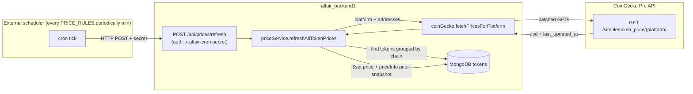
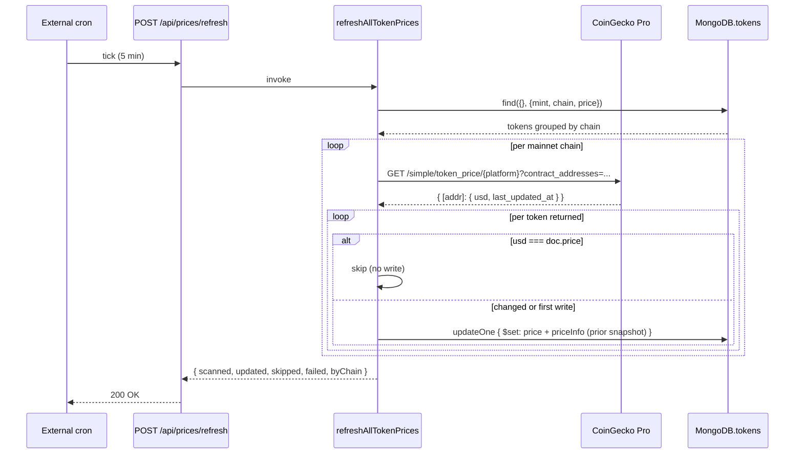

# Periodic CoinGecko Price Updates — Implementation Plan

## Overview

Persist a USD price (and a small history trail) onto every document in the `tokens` collection, refreshed periodically from CoinGecko's Pro API. The refresh cadence is configured via [`PRICE_RULES.fetchAllConditions.periodically`](../../config/blockchain_config.ts) (already present, currently `5` minutes).

This is the first of several planned triggers (the other keys under `fetchAllConditions` — `login`, `refresh`, `openWallet`, `changeChain`, `swapComplete`, `swapStart` — are currently commented out). Scope here is **the periodic trigger only**. No UI changes.

CoinGecko endpoint: `GET https://pro-api.coingecko.com/api/v3/simple/token_price/{platform}` (see [`docs/external_docs/CoinGecko/Simple Token Price Endpoint.pdf`](../../external_docs/CoinGecko/Simple%20Token%20Price%20Endpoint.pdf)).

---

## 1. Schema changes — [`Token.ts`](../../src/models/Token.ts)

### 1.1 New fields

Add to `TokenSchema`:

```ts
price: { type: Number, default: null, index: true },
priceInfo: {
  type: new Schema(
    {
      lastPrice: { type: Number, required: true },
      updatedAt: { type: Date, required: true },
      source: { type: String, required: true }, // e.g. 'coingecko'
    },
    { _id: false }
  ),
  default: null,
},
```

### 1.2 Semantics

- `price` is the **current** last-known USD price (most recent reading we've stored).
- `priceInfo` is a **single subdocument** describing the price `price` had right before the most recent change — `{ lastPrice, updatedAt, source }`. Read with `doc.priceInfo.lastPrice`, etc.
- On each successful price change, `priceInfo` is **overwritten** with a new subdocument. Documents never accumulate history — there is always exactly the current price and the one prior.
- First-ever price write (no prior `price` value): `priceInfo` is left as `null`. There's nothing prior to record.
- No write occurs if CoinGecko returns the same USD value we already have, so `priceInfo` only reflects an *observed change*, not every poll.

### 1.3 Index

The `price: { …, index: true }` index supports later "list tokens sorted by price" queries. Skip if not needed.

---

## 2. Config

### 2.1 [`blockchain_config.ts`](../../config/blockchain_config.ts) — already in place

`PRICE_RULES.fetchAllConditions.periodically` is the cadence in **minutes**. No change needed. (Reminder: this file is mirrored to `altair_frontend1/config/blockchain_config.ts` — any future edit must be made in both files per the sync warning.)

### 2.2 New config file — `altair_backend1/config/coinGecko_config.ts`

```ts
// Asset-platform IDs CoinGecko uses for our chains. Source: GET /asset_platforms.
export const COINGECKO_ASSET_PLATFORMS: Partial<Record<ChainKey, string>> = {
  ETH_MAINNET: 'ethereum',
  BASE_MAINNET: 'base',
  SOLANA_MAINNET: 'solana',
  // Testnets intentionally omitted — see §2.4.
};

// CoinGecko `coins/{id}` IDs for native tokens that don't have a contract address.
export const COINGECKO_NATIVE_COIN_IDS: Partial<Record<ChainKey, string>> = {
  ETH_MAINNET: 'ethereum',
  BASE_MAINNET: 'ethereum',
  SOLANA_MAINNET: 'solana',
};

export const COINGECKO_API = {
  baseUrl: 'https://pro-api.coingecko.com/api/v3',
  contractBatchSize: 50,   // safe ceiling for comma-separated contract_addresses
  requestTimeoutMs: 10_000,
  // Soft inter-batch delay so we don't fan out 100 contracts in one tick.
  interBatchDelayMs: 250,
};
```

### 2.3 Env var

```
COINGECKO_API_KEY=<pro key>
```

Read inside the CoinGecko client only; throw at call-time if missing (matches the pattern in [`privy.ts`](../../src/lib/privy.ts) and `resolveApiKeyForModel` in [`chat/route.ts`](../../src/app/api/chat/route.ts)).

### 2.4 Testnets

CoinGecko does not price testnet tokens. Two options, plan recommends **(a)**:

- **(a) Skip testnet tokens.** Any token whose `chain` is `BASE_SEPOLIA` / `ETH_SEPOLIA` / `SOLANA_DEVNET` is excluded from the price job. Cleanest.
- **(b) Mirror mainnet prices by symbol.** After mainnet prices are written, copy them to testnet documents with the same symbol. Adds complexity and a foot-gun (testnet USDC ≠ mainnet USDC liquidity, but for *display* the symbol-mapping is fine).

Go with (a) unless you want testnet UIs to show real-looking prices.

### 2.5 Native-token addresses

`simple/token_price/{platform}` requires `contract_addresses`. Native ETH and native SOL have no contract. Two paths, plan recommends **(a)**:

- **(a) Price natives via the wrapped contract.** WETH (per chain) and WSOL (`So11111111111111111111111111111111111111112`) are both in the `tokens` collection (or will be after the seed in §5). Their CoinGecko price equals ETH/SOL respectively.
- **(b) Add a second call to `GET /simple/price?ids=ethereum,solana`.** Cleaner conceptually, one extra round-trip.

(a) needs zero extra code in the CoinGecko client. The plan uses (a). (b) is captured in §10 as a future improvement.

---

## 3. CoinGecko client — `altair_backend1/src/lib/coinGecko.ts` (new)

Thin, dependency-free wrapper. Mirrors the structure of [`alchemyTokens.ts`](../../src/lib/alchemyTokens.ts).

```ts
import { COINGECKO_API } from '../../config/coinGecko_config';

export type CoinGeckoPriceEntry = {
  contractAddress: string; // lowercased for EVM, raw for Solana
  usd: number;
  lastUpdatedAt: number | null; // unix seconds from CoinGecko, may be null
};

export async function fetchPricesForPlatform(params: {
  platform: string;                 // 'ethereum' | 'base' | 'solana'
  contractAddresses: string[];      // already normalized
}): Promise<CoinGeckoPriceEntry[]> {
  // 1. require COINGECKO_API_KEY
  // 2. chunk addresses by COINGECKO_API.contractBatchSize
  // 3. for each chunk: GET /simple/token_price/{platform}
  //    ?contract_addresses=<csv>
  //    &vs_currencies=usd
  //    &include_last_updated_at=true
  //    header: x-cg-pro-api-key: <key>
  // 4. flatten { [address]: { usd, last_updated_at } } responses
  // 5. await sleep(interBatchDelayMs) between chunks
  // 6. wrap each fetch in withWaitLogger for consistency with other I/O
}
```

Behavior:

- Normalize EVM addresses to lowercase before both querying and matching the response. Solana addresses are case-sensitive — pass them through unchanged.
- A `429` from CoinGecko (Pro tier has a generous rate limit but is not unlimited) is logged with the same shape as the LLM rate-limit log in [`chat/route.ts:85`](../../src/app/api/chat/route.ts) and treated as a soft failure (the affected chunk is skipped; other chunks proceed).
- Non-200 responses log and return an empty array for that chunk; **never throw out of the loop** — partial price updates are better than zero.

---

## 4. Price update service — `altair_backend1/src/lib/priceService.ts` (new)

Single exported entry point:

```ts
export async function refreshAllTokenPrices(): Promise<{
  scanned: number;
  updated: number;
  skipped: number;
  failed: number;
  byChain: Record<string, { scanned: number; updated: number }>;
}>;
```

### 4.1 Algorithm

1. `await connectToDatabase()`.
2. Load tokens grouped by `chain` from Mongo:
   ```ts
   const tokens = await Token.find({}, { mint: 1, chain: 1, price: 1 }).lean();
   ```
   Group into `Map<ChainKey, TokenDoc[]>`. Drop tokens whose `chain` isn't a mainnet entry in `COINGECKO_ASSET_PLATFORMS` (handles §2.4 (a)).
3. For each mainnet chain in parallel (or sequentially — see §4.3):
   - Resolve the CoinGecko `platform` string.
   - Call `fetchPricesForPlatform({ platform, contractAddresses: tokens.map(t => t.mint) })`.
   - For each returned `{ contractAddress, usd, lastUpdatedAt }`:
     - Find the matching token doc by address (lowercased compare for EVM, raw for Solana).
     - If `usd === doc.price` → **skip** (no write, no `priceInfo` change, count as `skipped`).
     - Else → atomic update that **overwrites** `priceInfo` with the prior snapshot:
       ```ts
       const hasPriorPrice = doc.price !== null && doc.price !== undefined;
       await Token.updateOne(
         { mint: doc.mint },
         {
           $set: {
             price: usd,
             lastFetchedAt: new Date(),
             priceInfo: hasPriorPrice
               ? { lastPrice: doc.price, updatedAt: new Date(), source: 'coingecko' }
               : null,
           },
         }
       );
       ```
     - First-ever price write (no prior `price`): `priceInfo` is set to `null`. There's nothing prior to record.
4. Aggregate counters and return.

### 4.2 What doesn't trigger a `priceInfo` change

Polls where `usd === doc.price` produce no write at all, so `priceInfo` is untouched. `priceInfo` therefore reflects only the *most recent observed change* — stable assets like USDC will see their `priceInfo` rotate rarely; volatile assets will see it rotate on most polls.

### 4.3 Concurrency

Three chains, ~tens of tokens each. Sequential per chain is fine and keeps the rate-limit envelope predictable. Parallelizing across chains is safe (different platforms) but offers little speedup — go sequential unless we later care about end-to-end latency.

### 4.4 Wait-logger wrapping

Wrap the Mongo `find`, each `updateOne`, and each CoinGecko fetch in [`withWaitLogger`](../../src/lib/waitLogger.ts) so the existing latency telemetry covers this job too.

---

## 5. One-time seed of EVM tokens into the `tokens` collection

> Today the `tokens` collection only contains **Solana** tokens (populated by `saveJupiterToken` in [`test-swap/route.ts:821`](../../src/app/api/test-swap/route.ts)). EVM tokens live entirely in [`config/token_info/*.ts`](../../config/token_info/) and are never written to Mongo. Without a seed, the periodic price job would do nothing on EVM.

### 5.1 New script — `altair_backend1/scripts/seed-evm-tokens.ts`

For each EVM chain key (`ETH_MAINNET`, `BASE_MAINNET`) iterate the corresponding `token_info` module and upsert one Mongo doc per token:

```ts
await Token.updateOne(
  { mint: addressLower },
  {
    $setOnInsert: {
      mint: addressLower,
      chain: chainKey,
      symbol: token.symbol,
      name: token.name,
      decimals: token.decimals,
      source: 'token_info',
      lastFetchedAt: new Date(),
    },
  },
  { upsert: true }
);
```

Use `$setOnInsert` so re-running the seed doesn't clobber prices already written by the periodic job.

### 5.2 Mint key

The existing `mint` field is `unique`. For EVM rows we'll use the **lowercased** contract address. The Solana `mint` field is already address-cased; combining the two in one unique-index field is fine because EVM `0x…` and Solana base58 addresses never collide.

### 5.3 Native ETH

WETH per chain (`config/token_info/eth_tokens.ts:WETH`, `config/token_info/base_tokens.ts:WETH`) is the price source for native ETH on that chain (per §2.5). No separate row needed for "ETH" — the UI/balance reader maps the native symbol to the WETH price at read time. This is captured as future work in §10; the current step **just seeds whatever's in `token_info/`** and lets the price job follow.

> Decision point: do we want a separate "ETH" pseudo-doc in `tokens` so reads don't have to know about WETH-as-proxy? Two viable answers, plan defers until UI work begins.

### 5.4 Running it

```bash
cd altair_backend1
yarn tsx scripts/seed-evm-tokens.ts
```

(`tsx` is not currently a dep — alternative is `node --import tsx/esm` or compile-then-run; pick whichever matches the team's existing script-running pattern in `scripts/patch-0g-sdk.js`.)

---

## 6. Triggering the periodic job

**Decision: cron-job.org calls an authenticated route on our backend.**

cron-job.org is a free external HTTP-cron service with 1-minute granularity, no per-fire quota that matters at our load (~8.6k fires/month), and it's deploy-platform-agnostic — works whether we host on Vercel, Render, a VPS, or anywhere else. Multi-instance safe (only the route is invoked; only one run happens per fire). Survives our redeploys.

### 6.1 New route — `altair_backend1/src/app/api/prices/refresh/route.ts`

```ts
import { NextResponse } from 'next/server';
import { refreshAllTokenPrices } from '@/lib/priceService';
import { buildCorsHeaders } from '@/lib/appUrls';

const corsHeaders = buildCorsHeaders(null);

export async function POST(req: Request) {
  const provided = req.headers.get('x-altair-cron-secret');
  if (!provided || provided !== process.env.ALTAIR_CRON_SECRET) {
    return NextResponse.json({ error: 'unauthorized' }, { status: 401, headers: corsHeaders });
  }
  const result = await refreshAllTokenPrices();
  return NextResponse.json({ ok: true, ...result }, { headers: corsHeaders });
}

// GET is allowed for one-button manual runs from an authenticated browser session
// during ops/debugging; same secret check.
```

### 6.2 Secret

Add `ALTAIR_CRON_SECRET=<long random value>` to env. The cron service sends `x-altair-cron-secret: <same value>` on each fire.

### 6.3 Cadence wiring (cron-job.org)

In the cron-job.org dashboard, create a job:

- **URL:** `POST https://<backend-host>/api/prices/refresh`
- **Schedule:** every 5 minutes (matches `PRICE_RULES.fetchAllConditions.periodically`).
- **Custom header:** `x-altair-cron-secret: <ALTAIR_CRON_SECRET>`
- **Request timeout:** raise to ~30s so we don't get spurious failures during a slow CoinGecko response.
- **Notifications:** enable failure email/webhook so we hear about persistent 5xxs.

`PRICE_RULES.fetchAllConditions.periodically` in [`blockchain_config.ts`](../../config/blockchain_config.ts) is the **canonical** cadence — the cron-job.org schedule has to mirror it manually. If the config value ever changes, also update the cron-job.org schedule. To prevent drift, this two-place coupling is noted in [`docs/dev_notes/Config.md`](../Config.md) when the change ships.

### 6.4 Idempotency / overlap

The job is single-threaded over the `tokens` collection but unbounded in time. If a run takes longer than 5 minutes and a second cron tick fires, two runs will overlap on writes (last-write-wins per token; harmless given the algorithm in §4.1). If we want strict mutual exclusion later, add a Mongo-backed lock on a `cronLocks` collection with TTL. **Not in scope for this plan.**

---

## 7. Files to add / modify

| File | Change |
|---|---|
| [`altair_backend1/src/models/Token.ts`](../../src/models/Token.ts) | **Modify** — add `price` and `priceInfo` (§1) |
| `altair_backend1/config/coinGecko_config.ts` | **Add** — platform map, batch sizes, history limit (§2.2) |
| `altair_backend1/src/lib/coinGecko.ts` | **Add** — `fetchPricesForPlatform` client (§3) |
| `altair_backend1/src/lib/priceService.ts` | **Add** — `refreshAllTokenPrices` orchestrator (§4) |
| `altair_backend1/scripts/seed-evm-tokens.ts` | **Add** — one-time EVM token upsert (§5) |
| `altair_backend1/src/app/api/prices/refresh/route.ts` | **Add** — authenticated cron entry point (§6.1) |
| cron-job.org dashboard | **Configure** — 5-minute job hitting the refresh route with the shared secret header (§6.3) |
| `.env` / deploy secrets | **Add** — `COINGECKO_API_KEY`, `ALTAIR_CRON_SECRET` (§2.3, §6.2) |

No frontend changes. No changes to balance/swap routes.

---

## 8. Testing checklist

- [ ] **Unit:** `fetchPricesForPlatform` returns flattened entries from a mocked CoinGecko response; chunks at the batch boundary; survives a `429`-then-200 sequence on a later chunk.
- [ ] **Unit:** `refreshAllTokenPrices` with an in-memory Mongo:
  - Token with no prior `price` → `$set price`; `priceInfo` set to `null` (nothing prior to record).
  - Token with same `price` as response → no write, `skipped++`, `priceInfo` untouched.
  - Token with different `price` → `$set price`; `priceInfo` **overwritten** with the prior `{ lastPrice, updatedAt, source }`. Subsequent change overwrites it again — `priceInfo` is always a single subdocument or `null`, never a history.
- [ ] **Unit:** Testnet tokens (`chain` ∈ `BASE_SEPOLIA` / `ETH_SEPOLIA` / `SOLANA_DEVNET`) are excluded.
- [ ] **Integration:** seed script upserts EVM tokens; second run does not overwrite a price written by the price job (`$setOnInsert` works as intended).
- [ ] **Integration:** `POST /api/prices/refresh` without secret → 401. With secret → 200 and a counter payload that matches the actual `Token` collection state.
- [ ] **Manual:** trigger via curl on dev, inspect a token doc, confirm `price`, `priceInfo.lastPrice`, `priceInfo.updatedAt`, `priceInfo.source === 'coingecko'`. Trigger again with no upstream change → `priceInfo` unchanged.
- [ ] **Regression:** existing Jupiter `saveJupiterToken` path still upserts Solana tokens correctly (the new fields default cleanly because of `default: null` / `default: []`).
- [ ] **Regression:** `User.balances` and `/api/balances` are unaffected — verify no schema or query overlap with `tokens`.

---

## 9. Rollout

1. Land schema + service + route behind a closed cron config (no scheduled trigger yet).
2. Run the seed script once against staging.
3. Manually trigger `POST /api/prices/refresh` with the secret; verify a sample of tokens.
4. Enable the 5-minute cron in staging; let it run for ~24h; spot-check `priceInfo` growth on a volatile asset (`WBTC`, `WSOL`) versus a stable (`USDC`).
5. Repeat (2)–(4) against production.
6. Update [`docs/dev_notes/Config.md`](../Config.md) to mention `PRICE_RULES` and the cron contract.

---

## 10. Out of scope / future work

- **UI:** Reading `Token.price` from the wallet panel / chat balance block. Will be wired in once the data is reliably populated.
- **On-demand triggers:** `login`, `openWallet`, `swapStart`, etc. — currently commented out in `PRICE_RULES.fetchAllConditions`. Adding them is straightforward: each call site invokes a small wrapper that calls `refreshAllTokenPrices` (or a `refreshPricesForTokens(symbols, chain)` variant).
- **Native-token pseudo-rows:** see §5.3. Decide at UI integration time.
- **`/simple/price?ids=` fallback:** for cases where a token isn't on CoinGecko's contract index (illiquid memecoins, etc.) — could lookup by `coingecko_id` if we ever store one.
- **Cross-run locking:** §6.4 lock-collection if cron overlap ever becomes a problem.
- **Per-token cadence:** today every token refreshes at the same interval. A later optimization is to slow down stables and speed up volatile assets, driven by `priceInfo`'s observed change frequency.
- **Other price sources:** the `source` field on each `priceInfo` entry is forward-compatible with Pyth, Chainlink, Jupiter price API, etc.

---

## 11. Architecture diagram



---

## 12. Data flow per token



---

## 13. Decision points — all resolved

1. **`priceInfo` shape:** single subdocument with `{ lastPrice, updatedAt, source }`. Not a list, not a JS array — one object that gets overwritten on each price change. *(Confirmed.)* (§1.1, §1.2)
2. **Testnet pricing:** skip entirely. Testnet tokens are excluded from the job. *(Confirmed.)* (§2.4)
3. **Native ETH/SOL representation:** rely on WETH/WSOL rows; no pseudo-rows in `tokens`. *(Confirmed.)* (§5.3)
4. **Trigger mechanism:** cron-job.org calls authenticated `POST /api/prices/refresh` every 5 minutes. *(Confirmed.)* (§6)
5. **History depth:** by design only the current price and the immediately prior price are retained. No ring buffer, no length cap — the schema makes it impossible to accumulate more. *(Confirmed.)*
